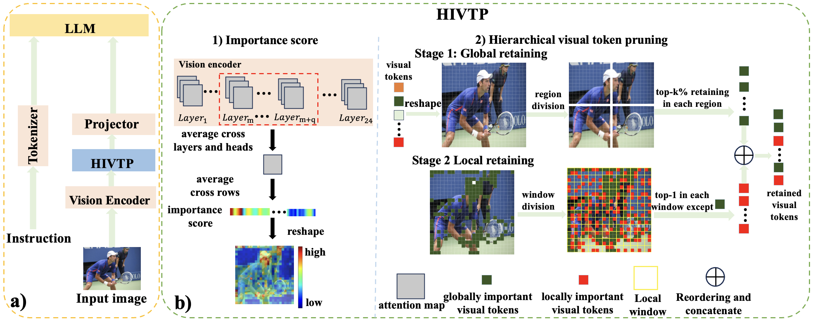

# HIVTP: A Training-Free Method to Improve VLMs Efficiency via Hierarchical Visual Token Pruning Using Middle-Layer-Based Importance Score

GOPrune is a **temporary** repository for an efficient visual token pruning method for Vision-Language Models (VLMs).    
It can be applied during **inference** to reduce inference time while allowing flexible control over the number of retained visual tokens, all while maintaining model performance.
## Overview

---

## Installation

Clone this repository and install:

```bash
git clone https://github.com/Blacktower27/GOPrune.git
cd GOPrune

pip install -e .
```

## Usage with lmms-eval

First, follow the official [lmms-eval installation guide](https://github.com/EvolvingLMMs-Lab/lmms-eval) to set up the environment. To integrate **GOPrune** into lmms-eval with LLaVA, you need to modify the `class Llava(lmms)` inside `lmms_eval/models/simple/llava.py`. Specifically, in the `__init__` function after loading the pretrained model, we insert the following code:

```python
try:
    # Try to load the model with the multimodal argument
    self._tokenizer, self._model, self._image_processor, self._max_length = load_pretrained_model(
        pretrained, None, model_name, device_map=self.device_map, **llava_model_args
    )
    from goprune import goprune
    self._model = goprune(self._model)
except TypeError:
    # for older versions of LLaVA that don't have multimodal argument
    llava_model_args.pop("multimodal", None)
    self._tokenizer, self._model, self._image_processor, self._max_length = load_pretrained_model(
        pretrained, None, model_name, device_map=self.device_map, **llava_model_args
    )
    from goprune import goprune
    self._model = goprune(self._model)
```    
After this modification, you can test our method on LLaVA using lmms-eval’s provided script:
```
bash examples/models/llava_next.sh
```
If you want to change the dataset, please directly modify this bash script in lmms-eval.

